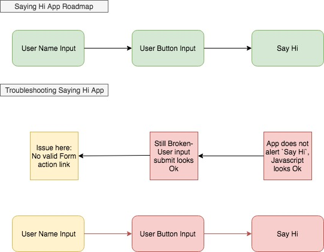
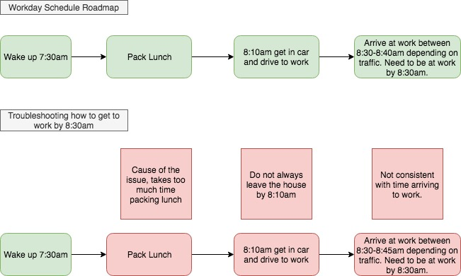

1. Practice breaking it down! Choose one of the following to explain as if the listener has never done it before:

 - What are the steps involved in making a phone call?

    1. Get Phone number of the person you want to call. The number should be 9 digits: `xxx-xxx-xxxx` with the area code.
    2. Find a **working** phone to use: Mobile, landline, payphone, etc.
    3. Once you have a working phone to use, dial in the phone number from step 1 that you would like to call
    4. Wait for the individual you are calling to answer the phone to speak to them. If they do not pick up try again later or leave a voice mail if you get the option to at the end of the call.

2. In our “Say Hi” example, if the Say Hi part of the program never runs, how would you narrow down the cause of the problem? Explain the process and use a roadmap to visualize it.
 

3. Create a problem-solving example using a roadmap and the process of elimination for narrowing down issues of your own. You already use this skill daily. Break down and explain a problem you solve in your everyday life.
 
